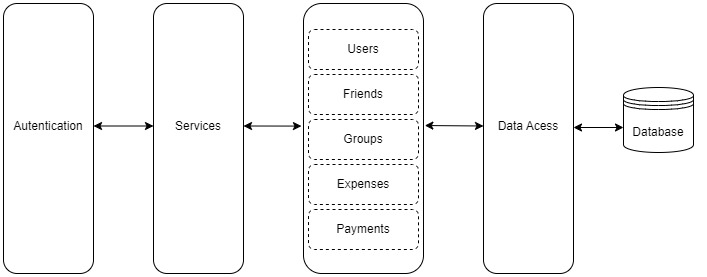
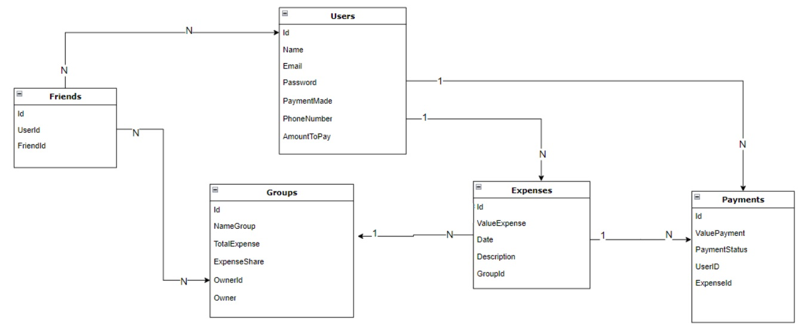

# APIs e Web Services

<!-- O planejamento de uma aplicação de APIS Web é uma etapa fundamental para o sucesso do projeto. Ao planejar adequadamente, você pode evitar muitos problemas e garantir que a sua API seja segura, escalável e eficiente.

Aqui estão algumas etapas importantes que devem ser consideradas no planejamento de uma aplicação de APIS Web.

[Inclua uma breve descrição do projeto.]-->

Uma API para uma aplicação de cadastro de despesas e divisão entre usuários de um grupo precisa fornecer recursos que permitam aos usuários gerenciar suas despesas de forma eficiente e colaborativa. Além de fornecer funcionalidades como autenticação e autorização.

## Objetivos da API

<!-- O primeiro passo é definir os objetivos da sua API. O que você espera alcançar com ela? Você quer que ela seja usada por clientes externos ou apenas por aplicações internas? Quais são os recursos que a API deve fornecer?

[Inclua os objetivos da sua api.] -->

A API busca fornecer recursos para execução das regras definidas para funcionamento da aplicação, além de outros recursos como autenticação e autorização de usuários. Seguem abaixo alguns dos principais objetivos:

**Cadastro de despesas:** <br/>
Permitir que os usuários criem novas despesas, especificando detalhes como o valor, a descrição e a data da despesa.
Associar cada despesa a um grupo específico para facilitar a divisão entre os membros.<br/>
**Divisão de despesas:** <br/>
Calcular automaticamente a divisão das despesas entre os membros do grupo.
Permitir que os usuários visualizem quanto cada membro deve pagar ou receber em relação a uma despesa específica.<br/>
**Controle de despesas pagas:** <br/>
Registrar quando um usuário paga uma despesa.
Atualizar automaticamente o saldo de cada usuário no grupo com base nas despesas pagas e na divisão das despesas.<br/>
**Gerenciamento de usuários e grupos:** <br/>
Permitir a criação e a gestão de grupos de usuários.
Facilitar a adição e a remoção de membros de um grupo pelo proprietário.<br/>
**Recursos de autenticação e autorização:** <br/>
Garantir que apenas usuários autorizados possam acessar e manipular dados de despesas e grupos.
Implementar autenticação para proteger as informações sensíveis dos usuários.<br/>
**Notificações e lembretes:** <br/>
Enviar notificações aos usuários sobre novas despesas, alterações na divisão das despesas ou despesas pendentes de pagamento.<br/>


## Arquitetura

<!-- [Descrição da arquitetura das APIs, incluindo os componentes e suas interações.] -->

A API de gestão de despesas é desenvolvida em C#, ASP.NET Core e segue uma arquitetura monolítica. A arquitetura inclui componentes para autenticação, manipulação de dados e acesso ao banco de dados.




## Modelagem da Aplicação
<!-- [Descreva a modelagem da aplicação, incluindo a estrutura de dados, diagramas de classes ou entidades, e outras representações visuais relevantes.] -->

Entidades Principais:
1 - Users: Informações cadastrais do usuário.
2 - Friends: Usuários associados a um grupo de amigos.
3 - Groups: Registro de dados relacionados ao grupo de despesas. 
4 - Expenses: Registro de despesas e valores associados ao grupo.
5 - Payments: Registro de pagamentos por integrante do grupo.




## Fluxo de Dados

[Diagrama ou descrição do fluxo de dados na aplicação.]

## Requisitos Funcionais

[Liste os principais requisitos funcionais da aplicação.]

## Requisitos Não Funcionais

[Liste os principais requisitos não funcionais da aplicação, como desempenho, segurança, escalabilidade, etc.]

## Tecnologias Utilizadas

Existem muitas tecnologias diferentes que podem ser usadas para desenvolver APIs Web. A tecnologia certa para o seu projeto dependerá dos seus objetivos, dos seus clientes e dos recursos que a API deve fornecer.

[Lista das tecnologias principais que serão utilizadas no projeto.]

## API Endpoints

[Liste os principais endpoints da API, incluindo as operações disponíveis, os parâmetros esperados e as respostas retornadas.]

### Endpoint 1
- Método: GET
- URL: /endpoint1
- Parâmetros:
  - param1: [descrição]
- Resposta:
  - Sucesso (200 OK)
    ```
    {
      "message": "Success",
      "data": {
        ...
      }
    }
    ```
  - Erro (4XX, 5XX)
    ```
    {
      "message": "Error",
      "error": {
        ...
      }
    }
    ```


## Considerações de Segurança

[Discuta as considerações de segurança relevantes para a aplicação distribuída, como autenticação, autorização, proteção contra ataques, etc.]

## Implantação

[Instruções para implantar a aplicação distribuída em um ambiente de produção.]

1. Defina os requisitos de hardware e software necessários para implantar a aplicação em um ambiente de produção.
2. Escolha uma plataforma de hospedagem adequada, como um provedor de nuvem ou um servidor dedicado.
3. Configure o ambiente de implantação, incluindo a instalação de dependências e configuração de variáveis de ambiente.
4. Faça o deploy da aplicação no ambiente escolhido, seguindo as instruções específicas da plataforma de hospedagem.
5. Realize testes para garantir que a aplicação esteja funcionando corretamente no ambiente de produção.

## Testes

[Descreva a estratégia de teste, incluindo os tipos de teste a serem realizados (unitários, integração, carga, etc.) e as ferramentas a serem utilizadas.]

1. Crie casos de teste para cobrir todos os requisitos funcionais e não funcionais da aplicação.
2. Implemente testes unitários para testar unidades individuais de código, como funções e classes.
3. Realize testes de integração para verificar a interação correta entre os componentes da aplicação.
4. Execute testes de carga para avaliar o desempenho da aplicação sob carga significativa.
5. Utilize ferramentas de teste adequadas, como frameworks de teste e ferramentas de automação de teste, para agilizar o processo de teste.

# Referências

Inclua todas as referências (livros, artigos, sites, etc) utilizados no desenvolvimento do trabalho.
