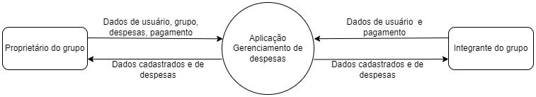

# APIs e Web Services

<!-- O planejamento de uma aplicação de APIS Web é uma etapa fundamental para o sucesso do projeto. Ao planejar adequadamente, você pode evitar muitos problemas e garantir que a sua API seja segura, escalável e eficiente.

Aqui estão algumas etapas importantes que devem ser consideradas no planejamento de uma aplicação de APIS Web.

[Inclua uma breve descrição do projeto.]-->

Uma API para uma aplicação de cadastro de despesas e divisão entre usuários de um grupo precisa fornecer recursos que permitam aos usuários gerenciar suas despesas de forma eficiente e colaborativa. Além de fornecer funcionalidades como autenticação e autorização.

## Objetivos da API

<!-- O primeiro passo é definir os objetivos da sua API. O que você espera alcançar com ela? Você quer que ela seja usada por clientes externos ou apenas por aplicações internas? Quais são os recursos que a API deve fornecer?

[Inclua os objetivos da sua api.] -->

A API busca fornecer recursos para execução das regras definidas para funcionamento da aplicação, além de outros recursos como autenticação e autorização de usuários. Seguem abaixo alguns dos principais objetivos:

**Cadastro de despesas:** <br/>
Permitir que os usuários criem novas despesas, especificando detalhes como o valor, a descrição e a data da despesa.
Associar cada despesa a um grupo específico para facilitar a divisão entre os membros.<br/>
**Divisão de despesas:** <br/>
Calcular automaticamente a divisão das despesas entre os membros do grupo.
Permitir que os usuários visualizem quanto cada membro deve pagar ou receber em relação a uma despesa específica.<br/>
**Controle de despesas pagas:** <br/>
Registrar quando um usuário paga uma despesa.
Atualizar automaticamente o saldo de cada usuário no grupo com base nas despesas pagas e na divisão das despesas.<br/>
**Gerenciamento de usuários e grupos:** <br/>
Permitir a criação e a gestão de grupos de usuários.
Facilitar a adição e a remoção de membros de um grupo pelo proprietário.<br/>
**Recursos de autenticação e autorização:** <br/>
Garantir que apenas usuários autorizados possam acessar e manipular dados de despesas e grupos.
Implementar autenticação para proteger as informações sensíveis dos usuários.<br/>
**Notificações e lembretes:** <br/>
Enviar notificações aos usuários sobre novas despesas, alterações na divisão das despesas ou despesas pendentes de pagamento.<br/>


## Arquitetura

<!-- [Descrição da arquitetura das APIs, incluindo os componentes e suas interações.] -->

A API segue uma arquitetura monolítica. A arquitetura inclui componentes para autenticação, manipulação de dados e acesso ao banco de dados.


## Modelagem da Aplicação
<!-- [Descreva a modelagem da aplicação, incluindo a estrutura de dados, diagramas de classes ou entidades, e outras representações visuais relevantes.] -->

Entidades:<br/>
1 - Users: Informações cadastrais do usuário.<br/>
2 - Friends: Usuários associados a um grupo de amigos.<br/>
3 - Groups: Registro de dados relacionados ao grupo de despesas. <br/>
4 - Expenses: Registro de despesas e valores associados ao grupo.<br/>
5 - Payments: Registro de pagamentos por integrante do grupo.<br/>


## Fluxo de Dados

<!-- [Diagrama ou descrição do fluxo de dados na aplicação.] -->

O diagrama abaixo ilustra a entrada e saída de dados entre os usuários na aplicação.



<br/>


## Requisitos Funcionais

<!-- [Liste os principais requisitos funcionais da aplicação.] -->

|ID    | Descrição do Requisito  | Prioridade |
|------|-----------------------------------------|----|
|RF-001| Os usuários podem criar grupos para gerenciar despesas. | ALTA |
|RF-002| Deve ser possível adicionar membros aos grupos.  | ALTA |
|RF-003| Os criadores dos grupos têm a capacidade de editar as configurações do grupo. | ALTA |
|RF-004| A aplicação deve garantir que apenas membros autorizados tenham acesso aos grupos de despesas.   | ALTA |
|RF-005| Os próprietários devem ser capazes de registrar despesas, indicando o valor, a descrição e a data. | ALTA |
|RF-006| A aplicação deve calcular automaticamente como dividir as despesas entre os membros do grupo. | ALTA |
|RF-008| Os usuários devem ser capazes de se cadastrar na aplicação. | MÉDIA |


## Requisitos Não Funcionais

<!--[Liste os principais requisitos não funcionais da aplicação, como desempenho, segurança, escalabilidade, etc.]-->

|ID     | Descrição do Requisito  |Prioridade |
|-------|-------------------------|----|
|RNF-001| A aplicação deverá respeitar às restrições impostas pela LGPD. (SEGURANÇA)| ALTA |
|RNF-002| A aplicação deve garantir a segurança dos dados do usuário. (SEGURANÇA) |  ALTA |

## Tecnologias Utilizadas

<!-- Existem muitas tecnologias diferentes que podem ser usadas para desenvolver APIs Web. A tecnologia certa para o seu projeto dependerá dos seus objetivos, dos seus clientes e dos recursos que a API deve fornecer.

[Lista das tecnologias principais que serão utilizadas no projeto.] -->

A **API REST** de gestão de despesas é desenvolvida na linguagem **C#** e o framework **ASP.NET Core**. <br/>

IDE: Visual Studio <br/>
Banco de dados: SQL Server <br/>
Documentação da API: Swagger <br/>


## API Endpoints

[Liste os principais endpoints da API, incluindo as operações disponíveis, os parâmetros esperados e as respostas retornadas.]

### Endpoint 1
- Resposta:
  - Sucesso (200 OK)
    ```
    {
      "message": "Success",
      "data": {
        ...
      }
    }
    ```
  - Erro (4XX, 5XX)
    ```
    {
      "message": "Error",
      "error": {
        ...
      }
    }
    ```
### Endpoint 1 User - Buscar Todos Usuário
- Método: {GET} /api/Users  <br/>
- Retorna uma lista de usuários <br/>
- Parâmetros: sem parâmetros  <br/>
 ```
[  
   { 
     "id": 1  
     "name": "Isabela_V1,
     "email": "usermple.com",  
     "phoneNumber": "31992235948",  
     "paymentMade": false, 
     "amountToPay": 0, 
     "groups": [], 
     "friends": []  
   }  
 ]  
 ```
```
Responses 
Code 200 Description Sucess 
```
### Endpoint 1 User -Criar Usuários
- Método: {POST} /api/Users 
- Cria um usuário.  <br/>
- Parâmetros: sem parâmetros <br/>
- Corpo da solicitação: objeto JSON  <br/>
```
Request body 

{ 
   "name": "Isabela_V1", 
   "email": "user@example.com", 
   "password": "123", 
   "phoneNumber": "31992235948" 
 }  
```
```
Response body 

{ 
   "name": "Isabela_V1", 
   "email": "user@example.com", 
   "password": "123", 
   "phoneNumber": "992235948" 
 } 
```
```
Responses 
Code 200 Description Sucess
```
### Endpoint 1 User  - Buscar o Usuário conforme o ID
- Método: {GET} /api/Users/{id} 
Retorna um usuário específico com o ID fornecido.  
Parâmetros: id (inteiro) 
```
Response body 

{   
"id": 1,   
"name": "Isabela_V1",   
"email": "user@example.com",
"phoneNumber": "992235948",   
"paymentMade": false,   
"amountToPay": 0,   
"groups": [], 
"friends": [] 
}
```

```
Responses 
Code 200 Description Sucess
```
### Endpoint 1 User - Atualizar um usuário existente com o ID fornecido.  
- Método: {PUT} /api/Users/{id} 
- Atualiza um usuário existente com o ID fornecido.  
- Parâmetros: id (inteiro)  
- Corpo da solicitação: objeto JSON  

```
Request body 
{ 
   "name": "Isabela_V1, 
   "email": "user@example.com", 
   "password": "123", 
   "phoneNumber": "31992235947" 
 }
```
```
Response body 
{ 
   "id": 0, 
   "name": "Isabela_V1", 
   "email": "user@example.com", 
   "phoneNumber": "992235947", 
   "paymentMade": false, 
   "amountToPay": 0, 
   "groups": [], 
   "friends": null 
 } 

Responses 
Code 200 Description Sucess 
```
### Endpoint 1 User - Excluir um usuário existente com o ID fornecido. 
- Método: {DELETE} /api/Users/{id} 
- Exclui um usuário existente com o ID fornecido.  
- Parâmetros: id (inteiro)
```
curl -X 'DELETE' \ 
   'https://localhost:7022/api/Users/1' \ 
   -H 'accept: */*'	 

Request URL 
https://localhost:7022/api/Users/1 
```
```
Responses 
Code 204 Description Sucess 
```

### Endpoint 2 Expense - Buscar Todas Despesas
- Método: {GET} /api/Users  <br/>
- Retorna uma lista de despesas <br/>
- Parâmetros: sem parâmetros  <br/>

 ```
{ 
  "id": 1, 
  "valueExpense": 4000, 
  "date": "2024-04-21T20:28:03.019Z", 
  "description": "hotel", 
  "groupId": 1, 
  "payments": [] 
}
 ```
```
Responses 
Code 200 Description Sucess 
```

### Endpoint 2 Expense - Criar Despesas
- Método: {POST} /api/Expenses 
- Cria uma despesa  <br/>
- Parâmetros: sem parâmetros  <br/>
- Corpo da solicitação: objeto JSON <br/>

```
Requets body 
{ 
  "id": 1, 
  "valueExpense": 4000, 
  "date": "2024-04-21T20:28:03.019Z", 
  "description": "hotel", 
  "groupId": 1, 
  "payments": [] 
}
```

```
Response  
Code 200  Description Success
```

### Endpoint 2 Expense - Retornar uma despesa específica
- Método: {GET} /api/Expenses/{id}
- Retorna uma despesa específica com o ID fornecido.
- Parâmetros: id (inteiro)

```
Response Body  
{ 
  "id": 1, 
  "valueExpense": 4000, 
  "date": "2024-04-21T20:28:03.019", 
  "description": "hotel", 
  "groupId": 1, 
  "payments": [] 
} 
```
```
Response   
Code 200 Description Success
```
### Endpoint 2 Expense -Atualizar uma despesa específica
- Método: {PUT} /api/Expenses/{id}
- Atualiza uma despesa existente com o ID fornecido.
- Parâmetros: id (inteiro)
- Corpo da solicitação: objeto JSON

```
{ 
  "valueExpense": 3000, 
  "date": "2024-04-21T20:35:06.015Z",
  "description": "hotel2", 
  "groupId": 1 
} 
```
### Endpoint 2 Expense - Excluir uma despesa específica
- Método: {DELETE} /api/Expenses/{id}
- Exclui uma despesa existente com o ID fornecido.  
- Parâmetros: id (inteiro)

```
Responses 
Code 204 Description Sucess 
```

## Considerações de Segurança

<!-- [Discuta as considerações de segurança relevantes para a aplicação distribuída, como autenticação, autorização, proteção contra ataques, etc.] -->

- Autenticação e autorização da API através do token JWT. (pendente de ajustes) <br/>
- Senhas: Armazenamento de senha via banco de dados. <br/>
  
## Implantação

[Instruções para implantar a aplicação distribuída em um ambiente de produção.]

1. Defina os requisitos de hardware e software necessários para implantar a aplicação em um ambiente de produção.
2. Escolha uma plataforma de hospedagem adequada, como um provedor de nuvem ou um servidor dedicado.
3. Configure o ambiente de implantação, incluindo a instalação de dependências e configuração de variáveis de ambiente.
4. Faça o deploy da aplicação no ambiente escolhido, seguindo as instruções específicas da plataforma de hospedagem.
5. Realize testes para garantir que a aplicação esteja funcionando corretamente no ambiente de produção.

## Testes

Com o objetivo de garantir o funcionamento correto da API, é importante realizar testes para identificar possíveis erros e corrigi-los antes que afetem negativamente a experiência dos usuários. 

Desse modo, foram definidos os seguintes testes: 

**Caso de teste: 1** <br>
Resumo: Criar Despesas 
Requisito: RF-001 
Prioridade: Alta 
Pré-condição: Estar cadastrado e logado no sistema 
Passos: 

1. Entrar no grupo de despesas 
2. Cadastrar a despesa, com a descrição e valor
3. Salvar Despesa

Resultado Esperado: Exibir mensagem “Despesa Cadastrada”

**Caso de teste: 2** <br>
Resumo: Adicionar membros aos grupos. 
Requisito: RF-002 
Prioridade: Alta 
Pré-condição: Estar cadastrado, logado no sistema, proprietário do grupo, membro estar cadastrado no sistema.  
Passos:

1. Entrar no grupo de despesas 
2. Adicionar membro
3. Salvar Membro
   
Resultado Esperado: Exibir mensagem “Membro Adicionado ao Grupo de Despesa”

**Caso de teste: 3** <br>
Resumo: Editar as configurações do grupo. 
Requisito: RF-003 
Prioridade: Alta 
Pré-condição: Estar cadastrado, logado no sistema, ser proprietário do grupo 
Passos:

1. Localizar e selecionar o grupo que você possui e deseja editar. 
2. Na página de detalhes do grupo, localize e clique no botão ou link para 'Configurações' ou 'Editar Grupo'. 
3. Altere as configurações desejadas do grupo, como nome do grupo.  
4. Salvar

Resultado Esperado: Exibir mensagem “Configurações Editadas com Sucesso”

**Caso de teste: 4** <br>
Resumo: Acessos aos grupos 
Requisito: RF-004 
Prioridade: Alta 
Pré-condição: A aplicação deve garantir que apenas membros autorizados tenham acesso aos grupos de despesas 
Passos: 

1. Estar logado na aplicação 
2. Escolher grupo do qual não tem autorização para acesso 
3. Tentar acesso ao grupo do qual não tem autorização  
4. Checar se todas as transações e informações dentro do grupo de despesas estão ocultas para usuários não autorizados.

Resultado Esperado: Exibir mensagem “Você não tem autorização para acessar o grupo”

**Caso de teste: 5** <br>
Resumo: Registrar despesa ao grupo. 
Requisito: RF-005 
Prioridade: Alta 
Pré-condição: Ser membro do grupo. 
Passos: 

1. Estar logado na aplicação 
2. Acessar o grupo de despesas 
3. Registrar nome da despesa 
4. Registrar valor da despesa 
5. Registrar data da despesa 
6. Registrar descrição da despesa 
7. Salvar

Resultado Esperado: Exibir mensagem “Despesa inserida com sucesso” 

**Caso de teste: 6** <br>
Resumo: Divisão das despesas 
Requisito: RF-006 
Prioridade: Alta 
Pré-condição: Ser membro do grupo, ter registro de despesas 
Passos: 

1. Acessar grupo 
2. Ser membro do grupo 
3. Registo de despesas no grupo 
4. Divisão de despesas por todos os membros do grupo 
5. Indicar o valor a ser pago individualmente

Resultado Esperado: Exibir mensagem “O valor a ser pago é de R$xx,xx por cada membro do grupo"

**Caso de teste: 7** <br>
Resumo: Cadastrar Usuároo 
Requisito: RF-007 
Prioridade: Média 
Pré-condição: Entrar no Sistema. 
Passos: 

1. Preencher com os dados do usuário 
2. Salvar registro.   

Resultado Esperado: Exibir mensagem “Cadastro realizado”

# Referências

Inclua todas as referências (livros, artigos, sites, etc) utilizados no desenvolvimento do trabalho.
