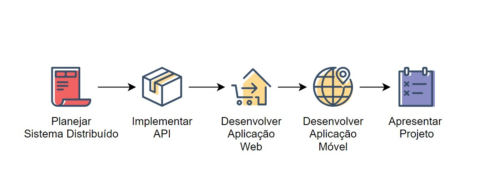
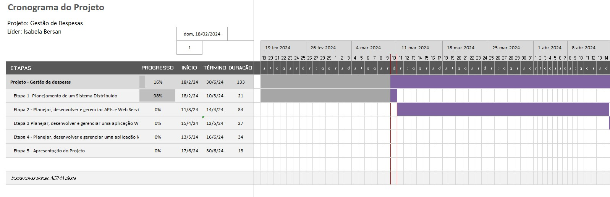
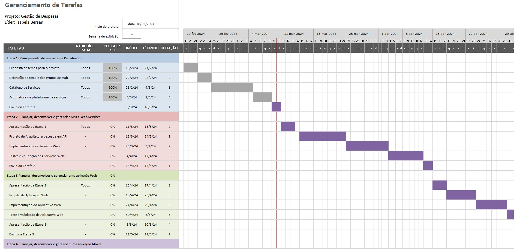
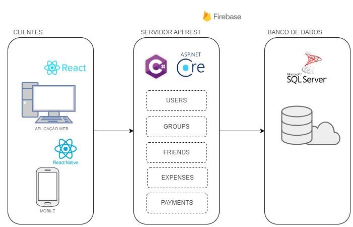

# Introdução

No cenário atual, é comum que as pessoas compartilhem despesas em eventos sociais, viagens, moradia e outras situações do cotidiano. Diante desse contexto surge a necessidade de simplificar as situações que envolvem divisão de despesas. Para atender a essa demanda, apresentamos um aplicativo projetado para tornar a gestão financeira compartilhada uma tarefa descomplicada e eficiente. 

## Problema

Devido à complexidade envolvida na divisão de despesas, muitas pessoas enfrentam dificuldades nesses momentos, especialmente durante viagens entre amigos. Antes da criação de soluções específicas, era comum encontrar dificuldades para acompanhar quem pagou por quê, quanto cada um deve e como equilibrar as contas de maneira justa e transparente. Essa falta de clareza e organização frequentemente resultava em atritos e desconfortos nos relacionamentos entre os envolvidos, prejudicando a experiência compartilhada. 

## Objetivos

O objetivo principal da aplicação é fornecer uma plataforma intuitiva e eficaz para a divisão, registro e gestão de despesas compartilhadas entre grupos. Com esse objetivo definido, serão estabelecidos objetivos específicos que guiarão o desenvolvimento do software. Entre esses objetivos, destacam-se o desenvolvimento de uma interface acessível e intuitiva, além da implementação de funcionalidades eficientes para o registro e gerenciamento das despesas.

## Justificativa

A justificativa para desenvolver este aplicativo surge da necessidade comum de simplificar a divisão de despesas em eventos sociais, como viagens e festas. Conflitos decorrentes da divisão desigual dos gastos são frequentes e podem afetar negativamente as relações entre os participantes. Com o objetivo de fornecer uma solução acessível e eficaz, concentramos nossos esforços no desenvolvimento de uma plataforma intuitiva para rastrear e gerenciar despesas compartilhadas, promovendo uma experiência mais harmoniosa para todos os envolvidos.

## Público-Alvo

O público-alvo do aplicativo é variado, incluindo pessoas entre 18 e 50 anos. Ele abrange desde estudantes universitários que dividem despesas até famílias e grupos de amigos que viajam juntos. Ao entender melhor esse público, podemos encontrar padrões de comportamento, necessidades compartilhadas e diferentes níveis de habilidade com a tecnologia. Isso ajuda a melhorar o aplicativo e adaptá-lo às necessidades do mercado. 

| Stakeholder  | Descrição  |
| ------ | ------ |
|Usuários Finais |Estudantes universitários, chefes de família e grupos de amigos viajantes que utilizam o aplicativo para dividir despesas entre si. |
|Desenvolvedores |Equipe responsável por manter e atualizar o aplicativo, garantindo sua funcionalidade e adaptabilidade às necessidades dos usuários. |

# Especificações do Projeto

Esta parte do documento visa proporcionar uma compreensão detalhada da especificação do projeto. Para isso, foram utilizadas técnicas e ferramentas como o mapa de empatia para a definição das personas, histórias de usuários, requisitos funcionais e não funcionais, além das restrições do projeto. A análise será realizada com base nas personas previamente desenvolvidas, abordando suas necessidades, desafios e aspirações para garantir a entrega de um produto centrado no usuário. 

Além disso, também realizamos o gráfico de Gantt com o objetivo de controlar e gerenciar o cronograma de atividades do um projeto. 

*Definição do problema e ideia de solução a partir da perspectiva do usuário. É composta pela definição do  diagrama de personas, histórias de usuários, requisitos funcionais e não funcionais além das restrições do projeto.

Apresente uma visão geral do que será abordado nesta parte do documento, enumerando as técnicas e/ou ferramentas utilizadas para realizar a especificações do projeto*

## Personas  

João, 18 anos, um jovem prestes a ingressar na faculdade, está focado em construir sua independência financeira. Ele busca maneiras de administrar suas despesas de forma responsável e participa ativamente de grupos online sobre educação financeira.  
João busca por uma solução que facilite a divisão justa de despesas entre amigos, proporcionando controle fácil sobre as despesas quando viaja entre amigos, vai a bares e até mesmo em organização de festas.

**Pensamentos e Sentimentos**
- João está no último ano do ensino médio, ansioso pela transição para a faculdade.  
- Preocupa-se em estabelecer sua independência financeira e aprender a gerenciar despesas.  
- Aspira a ter experiências sociais sem comprometer suas economias.  

**Ambiente**
- Frequenta escola, participa de atividades extracurriculares.  
- Ambiente digital: ativo em redes sociais e aplicativos de mensagens.  

**Amigos**
- Círculo social diversificado, composto por colegas de classe e amigos online.  
- Compartilha despesas em eventos sociais e saídas com amigos.  

**Ganhos**
- Deseja aprender a administrar seu dinheiro de forma responsável.  
- Procura maneiras simples e eficazes de dividir despesas entre amigos.  

**Dor**
- Medo de gastar mais dinheiro do que possui.  
- Dificuldade em organizar e rastrear despesas compartilhadas.  
- Receio de conflitos relacionados à divisão de gastos.  

**O que ele vê**
- Amigos buscando formas inovadoras de lidar com dinheiro.  
- Influenciadores digitais compartilhando dicas financeiras.  

**O que ele escuta**
- Amigos falando sobre suas experiências financeiras e desafios.  
- Professores incentivando a responsabilidade financeira. 

**O que ele fala e faz**
- Compartilha dicas e truques financeiros com amigos.  
- Participa de grupos online sobre educação financeira.  

Maria, 27 anos, uma profissional em ascensão, valoriza seu tempo e procura eficiência na gestão de suas despesas sociais e profissionais. Conectada a amigos por meio de redes sociais, ela busca soluções tecnológicas para otimizar tarefas e equilibrar gastos.  
Maria aspira a manter uma vida equilibrada entre o trabalho e o lazer, utilizando aplicativos eficientes para dividir despesas e minimizar conflitos.  

**Pensamentos e Sentimentos**
- Maria trabalha em tempo integral, buscando crescimento profissional.  
- Valoriza seu tempo livre e procura formas eficientes de gerenciar despesas sociais.  
- Aspira a manter um equilíbrio entre vida profissional e social.  

**Ambiente**
- Ambiente de trabalho corporativo.  
- Círculo social diversificado, composto por colegas de trabalho e amigos próximos.  

**Amigos**
- Compartilha despesas em eventos sociais e viagens com amigos.  
- Conectada a amigos por meio de aplicativos de mensagens e redes sociais.  

**Ganhos**
- Busca praticidade e rapidez na gestão de despesas compartilhadas.  
- Deseja equilibrar gastos sociais e profissionais de forma eficiente.  

**Dor**
- Falta de tempo para rastrear todas as despesas compartilhadas.  
- Estresse relacionado a cobranças e disputas sobre divisão de despesas.  
- Dificuldade em manter o equilíbrio financeiro.  

**O que ela vê**
- Colegas de trabalho adotando soluções tecnológicas para otimizar tarefas.  
- Amigos utilizando aplicativos financeiros para dividir despesas.  

**O que ela escuta**
- Amigos compartilhando experiências positivas com aplicativos de divisão de despesas.  
- Influenciadores falando sobre a importância da gestão financeira eficiente.  

**O que ela fala e faz**
- Indica aplicativos eficientes para amigos.  
- Participa de grupos online sobre equilíbrio entre vida profissional e pessoal.  

Ana, 38 anos, uma profissional consolidada com responsabilidades familiares, busca soluções organizacionais para sua vida financeira. Enfrentando desafios na divisão de despesas em eventos sociais, ela valoriza ferramentas que ofereçam praticidade e reduzam o estresse financeiro. Ana compartilha dicas de organização financeira com amigos e familiares, buscando harmonia nas despesas familiares e sociais através de uma gestão transparente e eficiente.  

**Pensamentos e Sentimentos**
- Ana é uma profissional consolidada, com responsabilidades familiares.  
- Valoriza a eficiência e procura soluções organizacionais para sua vida financeira.  
- Aspira a manter harmonia nas despesas familiares e sociais.  

**Ambiente**
- Ambiente de trabalho profissional e ambiente doméstico.  
- Círculo social composto por amigos de longa data e familiares.  

**Amigos**
- Compartilha despesas em eventos sociais e viagens em grupos familiares e de amigos.  
- Conectada a amigos e familiares por meio de redes sociais e eventos sociais.  

**Ganhos**
- Busca solução que facilite a organização e transparência nas despesas compartilhadas.  
- Valoriza ferramentas que ofereçam praticidade e reduzam o estresse financeiro.  

**Dor**
- Desafios em dividir as despesas de eventos sociais.  
- Necessidade de conciliar gastos familiares e individuais.  
- Preocupação com clareza nas divisões para evitar mal-entendidos.  

**O que ela vê**
- Amigos e colegas de trabalho utilizando tecnologias para otimizar tarefas.  
- Familiares compartilhando soluções para gestão financeira familiar.  

**O que ela escuta**
- Amigos e familiares compartilhando experiências positivas com aplicativos de divisão de despesas.  
- Profissionais falando sobre a importância de uma gestão financeira eficiente.  

**O que ela fala e faz**
- Compartilha dicas de organização financeira com amigos e familiares.  
Participa de grupos online sobre gestão financeira familiar

## Histórias de Usuários

Com base na análise das personas forma identificadas as seguintes histórias de usuários:

| EU COMO...                                      | QUERO/PRECISO ...                               | PARA ...                                           |
|--------------------------------------------------|------------------------------------|----------------------------------------|
| Usuário do sistema | Criar grupos para compartilhar despesas | Garantir que mais pessoas participem ativamente de todas as despesas |
| Usuário do sistema | Adicionar pessoas aos grupos | Garantir que todas as pessoas vejam e adicionem despesas ao grupo |
| Usuário do sistema | Adicionar despesas de forma fácil e transparente | Assegurar que todas as despesas do grupo sejam adicionadas com precisão |
| Usuário do sistema | Dividir despesas de acordo com as contribuições de cada pessoa | Evitar mal-entendidos financeiros durante a viagem e garantir que todos contribuam de maneira justa para uma experiência agradável. |
| Usuário do sistema | Receber notificações sobre novas despesas | Ficar sempre informado sobre as contribuições dos membros do grupo, facilitando a gestão e evitando esquecimentos. |
| Usuário do sistema | Acessar um histórico detalhado de transações | Ter uma visão clara de todas as despesas passadas, facilitando a análise e o acerto de contas dentro do grupo. |
| Administrador do sistema | Alterar permissões                       | Permitir que usuários possam administrar contas e grupos, tornando a gestão mais flexível e adaptável às necessidades do sistema. |

Apresente aqui as histórias de usuário que são relevantes para o projeto de sua solução. As Histórias de Usuário consistem em uma ferramenta poderosa para a compreensão e elicitação dos requisitos funcionais e não funcionais da sua aplicação. Se possível, agrupe as histórias de usuário por contexto, para facilitar consultas recorrentes à essa parte do documento.

> **Links Úteis**:
> - [Histórias de usuários com exemplos e template](https://www.atlassian.com/br/agile/project-management/user-stories)
> - [Como escrever boas histórias de usuário (User Stories)](https://medium.com/vertice/como-escrever-boas-users-stories-hist%C3%B3rias-de-usu%C3%A1rios-b29c75043fac)
> - [User Stories: requisitos que humanos entendem](https://www.luiztools.com.br/post/user-stories-descricao-de-requisitos-que-humanos-entendem/)
> - [Histórias de Usuários: mais exemplos](https://www.reqview.com/doc/user-stories-example.html)
> - [9 Common User Story Mistakes](https://airfocus.com/blog/user-story-mistakes/)

## Requisitos

As tabelas que se seguem apresentam os requisitos funcionais e não funcionais que detalham o escopo do projeto. Para determinar a prioridade de requisitos, aplicar uma técnica de priorização de requisitos e detalhar como a técnica foi aplicada.

### Requisitos Funcionais

|ID    | Descrição do Requisito  | Prioridade |
|------|-----------------------------------------|----|
|RF-001| Os usuários podem criar grupos para gerenciar despesas. | ALTA | 
|RF-002| Deve ser possível adicionar membros aos grupos.  | ALTA |
|RF-003| Os proprietários dos grupos têm a capacidade de editar as configurações do grupo. | ALTA | 
|RF-004| A aplicação deve garantir que apenas membros autorizados tenham acesso aos grupos de despesas.   | ALTA |
|RF-006| Os usuários devem ser capazes de registrar despesas, indicando o valor, a descrição e a data. | ALTA | 
|RF-007| Deve ser possível associar uma despesa a um grupo específico.  | ALTA |
|RF-008| A aplicação deve calcular automaticamente como dividir as despesas entre os membros do grupo. | ALTA | 
|RF-009| Os usuários podem ajustar a distribuição das despesas de forma a ser feita igualmente.   | ALTA |
|RF-010| Os usuários devem ter acesso a um histórico detalhado de todas as transações do grupo. | ALTA | 
|RF-011| Os usuários devem ser capazes de se cadastrar na aplicação. | MÉDIA |
|RF-012| A aplicação deve ser capaz de exibir resumos mensais ou semanais.  | BAIXA |
|RF-013| Os membros do grupo devem receber notificações sobre despesas recentes, alterações na divisão de despesas. | BAIXA | 
|RF-014| A aplicação deve fornecer relatórios visuais sobre os gastos do grupo.  | BAIXA |

### Requisitos não Funcionais

|ID     | Descrição do Requisito  |Prioridade |
|-------|-------------------------|----|
|RNF-001| A aplicação deverá respeitar às restrições impostas pela LGPD. (SEGURANÇA)| ALTA | 
|RNF-002| A aplicação deve garantir a segurança dos dados do usuário. (SEGURANÇA) |  ALTA | 
|RNF-003| A aplicação deve ser compatível com os principais navegadores web e sistemas operacionais móveis. (AMBIENTE) | ALTA | 
|RNF-004| A aplicação deve lidar eficientemente com um grande volume de requisições. (CONFIABILIDADE)  |  ALTA | 
|RNF-005| A aplicação deve ser capaz de lidar com um aumento no número de usuários e requisições sem degradação significativa do desempenho. (CONFIABILIDADE) | ALTA | 
|RNF-006| A interface do usuário deve ser intuitiva e fácil de usar, mesmo para usuários iniciantes. (USABILIDADE) |  ALTA | 
|RNF-007| A aplicação deve ter um tempo de resposta aceitável para garantir uma experiência do usuário fluida. (CONFIABILIDADE) | MÉDIA | 
|RNF-008| Tempo de resposta de cada requisição deve ser < 5000 ms. (CONFIABILIDADE) |  MÉDIA | 
|RNF-009| O sistema deverá fazer uso de design responsivo nas interfaces gráficas.(USABILIDADE) | MÉDIA | 
|RNF-010| O sistema deve estar disponível 99,99% do tempo.(DISPONIBILIDADE) |  MÉDIA | 
|RNF-011| O sistema deve ser responsivo para rodar em um dispositivos móvel.(DISPONIBILIDADE) | MÉDIA | 
|RNF-012| O sistema deverá rodar nas plataformas iOS, Android e Web. (PORTABILIDADE) |  MÉDIA | 

Com base nas Histórias de Usuário, enumere os requisitos da sua solução. Classifique esses requisitos em dois grupos:

- [Requisitos Funcionais
 (RF)](https://pt.wikipedia.org/wiki/Requisito_funcional):
 correspondem a uma funcionalidade que deve estar presente na
  plataforma (ex: cadastro de usuário).
- [Requisitos Não Funcionais
  (RNF)](https://pt.wikipedia.org/wiki/Requisito_n%C3%A3o_funcional):
  correspondem a uma característica técnica, seja de usabilidade,
  desempenho, confiabilidade, segurança ou outro (ex: suporte a
  dispositivos iOS e Android).
Lembre-se que cada requisito deve corresponder à uma e somente uma
característica alvo da sua solução. Além disso, certifique-se de que
todos os aspectos capturados nas Histórias de Usuário foram cobertos.

## Restrições

O projeto está restrito pelos itens apresentados na tabela a seguir.

|ID| Restrição                                             |
|--|-------------------------------------------------------|
|01| O projeto deverá ser entregue até o final do semestre |
|02| Não pode ser desenvolvido um módulo de backend        |

Enumere as restrições à sua solução. Lembre-se de que as restrições geralmente limitam a solução candidata.

> **Links Úteis**:
> - [O que são Requisitos Funcionais e Requisitos Não Funcionais?](https://codificar.com.br/requisitos-funcionais-nao-funcionais/)
> - [O que são requisitos funcionais e requisitos não funcionais?](https://analisederequisitos.com.br/requisitos-funcionais-e-requisitos-nao-funcionais-o-que-sao/)

# Catálogo de Serviços
*Descreva aqui todos os serviços que serão disponibilizados pelo seu projeto, detalhando suas características e funcionalidades.*

O aplicativo visa oferecer serviços para simplificar e aprimorar a divisão de despesas entre os usuários. Os usuários têm a capacidade de criar grupos, proporcionando um ambiente organizado para gerenciar suas despesas financeiras compartilhadas. Dentro desses grupos, é possível adicionar membros, dando a flexibilidade de envolver amigos, familiares ou colegas em atividades conjuntas. 

Os criadores dos grupos possuem o controle total sobre as configurações do grupo, permitindo a personalização de preferências conforme necessário. A aplicação, por sua vez, assegura a privacidade dos grupos, garantindo que apenas membros autorizados possam acessar e visualizar as informações pertinentes. 

A funcionalidade de registrar despesas torna-se simples e intuitiva, permitindo que os usuários indiquem o valor, a descrição e a data da transação. Associar essas despesas a grupos específicos facilita o rastreamento e a categorização eficaz. 

A automação desempenha um papel fundamental no cálculo da divisão de despesas entre os membros do grupo, proporcionando praticidade.  

Para manter a transparência, a aplicação disponibiliza um histórico detalhado de todas as transações realizadas no grupo. Isso permite que os usuários revisitem e analisem as atividades anteriores, promovendo uma compreensão mais clara dos gastos compartilhados. 

O processo de entrada na plataforma é simplificado, com um processo de cadastro que concede aos usuários acesso imediato aos serviços oferecidos. Além disso, o sistema de notificações mantém os membros do grupo informados sobre despesas recentes e alterações na divisão, promovendo uma comunicação eficaz entre os usuários. 

Em resumo, o aplicativo busca fornecer uma solução abrangente e eficiente para a gestão colaborativa de despesas, atendendo às expectativas dos usuários em termos de praticidade, transparência e controle financeiro. 

# Gerenciamento de Projeto

Para gerenciamento do projeto foram desenvolvidos os controles abaixo, garantindo assim atualização do cronograma e esforço aplicado na execução de cada etapa, além de ter maior assertividade quanto ao dimensionamento de recursos por tarefa.

## Gerenciamento de Tempo

Diagrama simplificado indicando as principais etapas do projeto.

O gráfico de Gantt abaixo indica a linha do tempo previsto para execução das 5 etapas do projeto, assim como os dias estimados para cada etapa, o percentual de progresso e as datas estimadas.

## Gerenciamento de Equipe

O cronograma abaixo indica a linha do tempo previsto para cada tarefa, o percentual de progresso, as datas estimadas e os integrantes da equipe que estão atuando na etapa.

# Arquitetura da Solução

Definição de como o software é estruturado em termos dos componentes que fazem parte da solução e do ambiente de hospedagem da aplicação.

## Tecnologias Utilizadas
As tecnologias que utilizaremos para implementar a solução:

**Back-end**: Utilizaremos o C# e o framework ASP.NET Core

**Front-end**: JavaScript e a biblioteca React

**Mobile**: React Native

**IDE de desenvolvimento**: Visual Studio

**Mensageria**: Kafka ou RabbitMQ

**Banco de dados**: MySQL

## Hospedagem

Explique como a hospedagem e o lançamento da plataforma foi feita.

> **Links Úteis**:
>
> - [Website com GitHub Pages](https://pages.github.com/)
> - [Programação colaborativa com Repl.it](https://repl.it/)
> - [Getting Started with Heroku](https://devcenter.heroku.com/start)
> - [Publicando Seu Site No Heroku](http://pythonclub.com.br/publicando-seu-hello-world-no-heroku.html)
