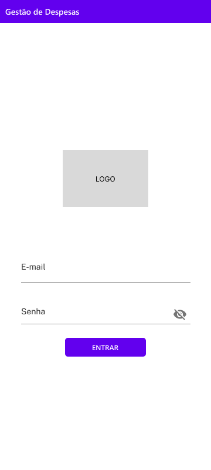
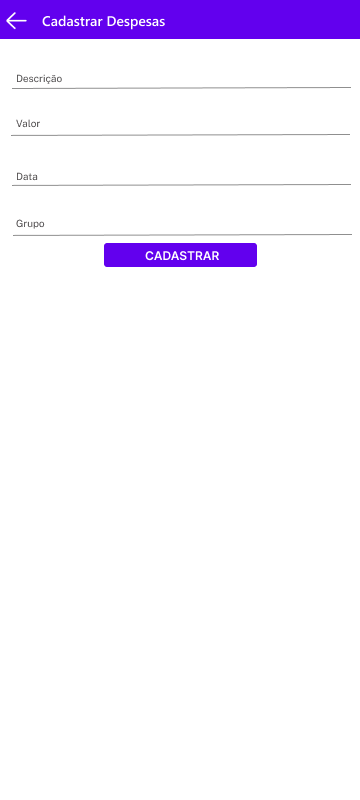
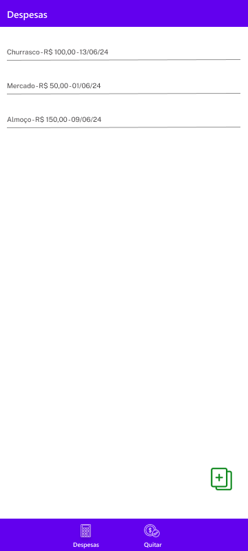
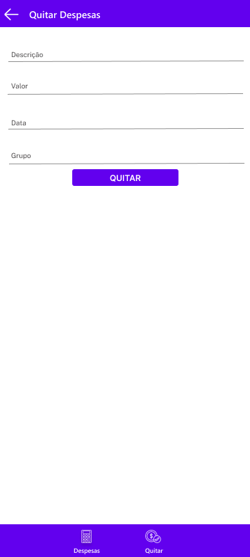
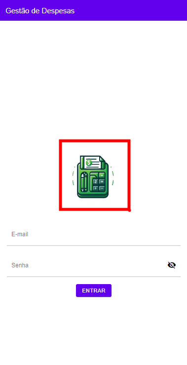

# Front-end Móvel

<!-- [Inclua uma breve descrição do projeto e seus objetivos.] -->
Descrição do Projeto: 
 O projeto "Gestão de Despesas" é um aplicativo desenvolvido para simplificar a gestão financeira compartilhada em diversas situações e em qualquer lugar a partir do dispositivo móvel. Ele visa eliminar as dificuldades comuns na divisão de despesas, proporcionando uma plataforma intuitiva e eficiente para registro e gerenciamento das despesas compartilhadas. O objetivo é promover uma experiência mais harmoniosa para todos os envolvidos, independentemente de seus perfis e habilidades tecnológicas. 

Objetivos: 

* Facilitar a divisão justa de despesas entre amigos e grupos. 
* Oferecer uma interface intuitiva e acessível. 
* Promover transparência e clareza na gestão das despesas. 

## Tecnologias Utilizadas
<!--[Lista das tecnologias principais que serão utilizadas no projeto.]-->

Front-end:
 
* React Native.  
* React Native Paper.

Back-end:
 
* Node.js (para API RESTful). 

## Arquitetura

<!-- [Descrição da arquitetura das aplicação móvel, incluindo os componentes e suas interações.] -->

Descrição da Arquitetura:
 
* Camada de Apresentação (Front-end): Utiliza React Native para interfaces móvei.
* Camada de Aplicação (Back-end): Node.js com uma API RESTful para gerenciamento de dados e lógica de negócios. 

Componentes e suas Interações: 

* Aplicativo Móvel: Interface do usuário, registro de despesas, quitação de despesas, visualização de histórico. 
* API RESTful: Interage com o front-end para enviar e receber dados. 
* Banco de Dados: Armazena informações de usuários, grupos, despesas e transações. 

## Modelagem da Aplicação
<!-- [Descreva a modelagem da aplicação, incluindo a estrutura de dados, diagramas de classes ou entidades, e outras representações visuais relevantes.] -->

**Entidades**: 
**1 - Users**: Informações cadastrais do usuário. 
**2 - Friends**: Usuários associados a um grupo de amigos. 
**3 - Groups**: Registro de dados relacionados ao grupo de despesas.  
**4 - Expenses**: Registro de despesas e valores associados ao grupo. 
**5 - Payments**: Registro de pagamentos por integrante do grupo. 

## Projeto da Interface
<!-- [Descreva o projeto da interface móvel da aplicação, incluindo o design visual, layout das páginas, interações do usuário e outros aspectos relevantes.] -->

**Interface Web da Aplicação**: 

**Tela de Login**: 
Esta tela apresenta campos de entrada para o e-mail do usuário e senha para que seja realizado o login na aplicação mobile. 

**Tela de Cadastro de Despesa**: 
Ao selecionar, os usuários podem cadastrar despesas nesta janela. Campos são fornecidos para especificar o valor da despesa, descrição da despesa, data e grupo. 

**Tela de Nova Despesa**: 
Ao selecionar um grupo específico, os usuários podem adicionar novas despesas nesta janela. Campos são fornecidos para especificar o valor da despesa, descrição da despesa, data e grupo.
Os usuários têm a opção de salvar a despesa e continuar adicionando mais, ou finalizar e retornar ao painel principal. 

**Tela de Quitação de Despesa**: 
Quando uma despesa é liquidada por um membro, esta tela permite que eles registrem o pagamento.
O usuário seleciona a despesa a ser quitada e modifica seu status. 
Após a confirmação, o saldo é atualizado automaticamente para refletir o pagamento. 

### Wireframes
<!-- [Inclua os wireframes das páginas principais da interface, mostrando a disposição dos elementos na página.] -->

Abaixo temos a apresentação dos wireframes da aplicação Gestão de Despesas Mobile. Aqui, oferecemos um vislumbre do design e da estrutura da plataforma de gestão de despesas compartilhadas: 

* **Tela de Login** 
 

* **Tela de Cadastro de Despesa** 
 

* **Tela de Nova Despesa** 
 

* **Tela de Quitação de Despesa** 
 

### Design Visual
<!-- [Descreva o estilo visual da interface, incluindo paleta de cores, tipografia, ícones e outros elementos gráficos.] -->

Para a página Login escolhemos uma logo na cor Verde com elementos visuais que transmita a ideia de desesas, contas a serem pagas e gerenciadas. Na parte superior e inferior foi utilizada a cor Roxa, codígo Hex: 6200EE. A fonte utilizada foi Segoe UI  

 

Utilizamos cores sólidas, no backgroud foi escolhida a cor branca cujo código Hex é FFFFFF. Na parte superior e inferior foi utilizada a cor Roxa, codígo Hex: 6200EE  

 

Por fim, utilizamos o ícone de "Calculator" para remeter o usuário para a página de Despesas, o ícone "dollar" para Quitar as depesas. O ícone add foi utilizado caso o uso queira adicionar novas despesas.  

 

### Layout Responsivo
<!-- [Discuta como a interface será adaptada para diferentes tamanhos de tela e dispositivos.] -->

 A adaptação da interface para diferentes tamanhos de tela e dispositivos é essencial para garantir uma experiência de usuário consistente e acessível em todos os contextos. Para o Gestão de Despesas, foi implementada uma abordagem responsiva de design, que se ajusta dinamicamente para se adequar a diferentes dispositivos míveis, como tablets e smartphones. Seguem algumas considerações e técnicas aplicadas: 

**Layout Flexível**: O layout da aplicação será construído com base em grades flexíveis e fluidas, permitindo que os elementos se reorganizem e redimensionem conforme o tamanho da tela. Isso garante que a disposição dos elementos se adapte de forma natural a qualquer dispositivo. 

**ícones Responsivas**: Os ícones na aplicação serão configurados como responsivos, ajustando automaticamente seu tamanho e resolução de acordo com as características do dispositivo. Isso ajuda a reduzir o tempo de carregamento e melhora o desempenho em dispositivos móveis. 

**Navegação Simplificada**:A navegação será simplificada e otimizada para toque. 

**Testes em Diferentes Dispositivos**: Faremos testes extensivos da aplicação em uma variedade de dispositivos e tamanhos de tela para garantir que a experiência do usuário seja consistente e sem problemas em todos os casos. 

Ao implementar essas técnicas de design responsivo, irá oferecer uma experiência de usuário intuitiva e eficaz, independentemente do dispositivo utilizado para acessá-la. Isso é fundamental para alcançar uma ampla base de usuários e garantir a satisfação do cliente em todas as interações com a aplicação. 

### Interações do Usuário

<!--[Descreva as interações do usuário na interface, como animações, transições entre páginas e outras interações.]-->

Na interface da Gestão de Despesas, priorizamos interações simples e eficientes para proporcionar uma experiência fluida. Seguem algumas das principais interações: 

**Transições Suaves**: As transições entre páginas são suaves para manter a navegação fluida. 
**Respostas de Formulário**: Feedback imediato é dado ao enviar formulários, usando pop-ups ou ícones para comunicar sucesso ou falha. 
**Scroll Suave**: Animamos a rolagem para uma transição suave entre seções, melhorando a experiência de navegação. 

 Essas interações são implementadas de forma aprimorar a usabilidade, sem sobrecarregar o usuário com excesso de animações ou feedbacks visuais. 

## Fluxo de Dados

<!-- [Diagrama ou descrição do fluxo de dados na aplicação.] -->

O diagrama abaixo ilustra a entrada e saída de dados entre os usuários na aplicação.  

 

## Requisitos Funcionais

<!-- [Liste os principais requisitos funcionais da aplicação.] -->

|ID    | Descrição do Requisito  | Prioridade |
|------|-----------------------------------------|----|
|RF-001| A aplicação deve garantir que apenas membros autorizados tenham acesso aos grupos de despesas.   | ALTA |
|RF-002| Os próprietários devem ser capazes de registrar despesas, indicando o valor, a descrição e a data. | ALTA |
|RF-003| Os usuários devem ter acesso a um histórico detalhado de todas as transações do grupo. | ALTA |
|RF-004| A aplicação deve calcular automaticamente como dividir as despesas entre os membros do grupo. | ALTA |

## Requisitos Não Funcionais

<!-- [Liste os principais requisitos não funcionais da aplicação, como desempenho, segurança, escalabilidade, etc.] -->

|ID     | Descrição do Requisito  |Prioridade |
|-------|-------------------------|----|
|RNF-001| A aplicação deverá respeitar às restrições impostas pela LGPD. (SEGURANÇA)| ALTA |
|RNF-002| A aplicação deve garantir a segurança dos dados do usuário. (SEGURANÇA) |  ALTA |
|RNF-003| A aplicação deve ser capaz de lidar com um aumento no número de usuários e requisições sem degradação significativa do desempenho. (CONFIABILIDADE) | ALTA | 
|RNF-004| A interface do usuário deve ser intuitiva e fácil de usar, mesmo para usuários iniciantes. (USABILIDADE) |  ALTA | 
|RNF-005| A aplicação deve ter um tempo de resposta aceitável para garantir uma experiência do usuário fluida. (CONFIABILIDADE) | MÉDIA | 
|RNF-006| O sistema deverá fazer uso de design responsivo nas interfaces gráficas.(USABILIDADE) | MÉDIA | 
|RNF-07| O sistema deve ser responsivo para rodar em um dispositivos móvel.(DISPONIBILIDADE) | MÉDIA | 

## Considerações de Segurança

<!-- [Discuta as considerações de segurança relevantes para a aplicação distribuída, como autenticação, autorização, proteção contra ataques, etc.] -->

Autenticação: Autenticação e autorização da API através do token JWT.  
Senhas: Armazenamento de senha via banco de dados.  
Autorização: Controle de acesso baseado em papéis.  
Prevenção de Ataques: Proteção contra ataques comuns (SQL Injection, XSS)  

## Implantação

<!-- [Instruções para implantar a aplicação distribuída em um ambiente de produção.] -->

<!-- 1. Defina os requisitos de hardware e software necessários para implantar a aplicação em um ambiente de produção. -->

1. Requisitos de Hardware e Software:
* Servidores com Node.js instalado.
* Banco de dados Microsoft SQL Server.
* Infraestrutura de nuvem.

<!-- 2. Escolha uma plataforma de hospedagem adequada, como um provedor de nuvem ou um servidor dedicado. -->
   
2. Plataforma de Hospedagem:
* Provedor de nuvem: Render.
   
<!-- 3. Configure o ambiente de implantação, incluindo a instalação de dependências e configuração de variáveis de ambiente. -->

3. Configuração do Ambiente de Implantação:

* Instalação de dependências (Node.js, banco de dados).
* Configuração de variáveis de ambiente (chaves de API, credenciais de banco de dados).

<!-- 4. Faça o deploy da aplicação no ambiente escolhido, seguindo as instruções específicas da plataforma de hospedagem.-->

4. Deploy da Aplicação:

* Seguir as instruções da plataforma de hospedagem.
* Configuração de servidores, DNS e balanceamento de carga.

<!-- 5. Realize testes para garantir que a aplicação esteja funcionando corretamente no ambiente de produção.-->

5. Testes:

* Testes de funcionalidade para garantir que a aplicação esteja funcionando corretamente.
* Testes de desempenho e segurança.

## Testes

[Descreva a estratégia de teste, incluindo os tipos de teste a serem realizados (unitários, integração, carga, etc.) e as ferramentas a serem utilizadas.]

1. Crie casos de teste para cobrir todos os requisitos funcionais e não funcionais da aplicação.
2. Implemente testes unitários para testar unidades individuais de código, como funções e classes.
3. Realize testes de integração para verificar a interação correta entre os componentes da aplicação.
4. Execute testes de carga para avaliar o desempenho da aplicação sob carga significativa.
5. Utilize ferramentas de teste adequadas, como frameworks de teste e ferramentas de automação de teste, para agilizar o processo de teste.

# Referências

Inclua todas as referências (livros, artigos, sites, etc) utilizados no desenvolvimento do trabalho.
