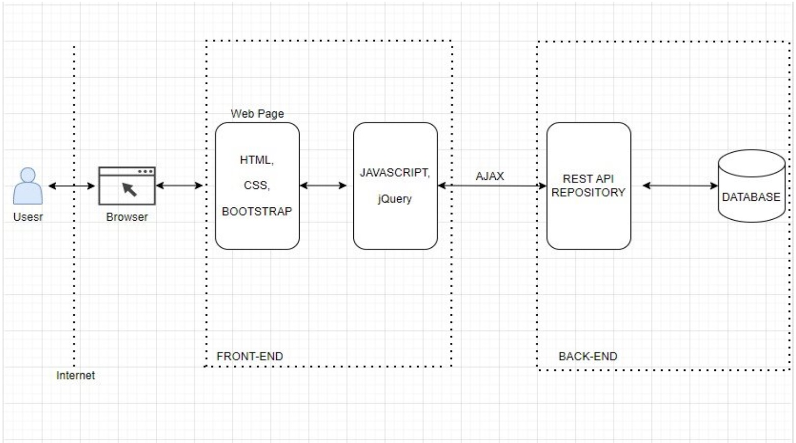

# Front-end Móvel

<!-- [Inclua uma breve descrição do projeto e seus objetivos.] -->
Descrição do Projeto: 
 O projeto "Gestão de Despesas" é um aplicativo desenvolvido para simplificar a gestão financeira compartilhada em diversas situações e em qualquer lugar a partir do dispositivo móvel. Ele visa eliminar as dificuldades comuns na divisão de despesas, proporcionando uma plataforma intuitiva e eficiente para registro e gerenciamento das despesas compartilhadas. O objetivo é promover uma experiência mais harmoniosa para todos os envolvidos, independentemente de seus perfis e habilidades tecnológicas. 

Objetivos: 

* Facilitar a divisão justa de despesas entre amigos e grupos. 
* Oferecer uma interface intuitiva e acessível. 
* Promover transparência e clareza na gestão das despesas. 

## Tecnologias Utilizadas
<!--[Lista das tecnologias principais que serão utilizadas no projeto.]-->

Front-end:
 
* React Native (para uma experiência nativa em dispositivos iOS e Android). 
* HTML, CSS, Bootstrap (para web interfaces). 
* JavaScript, jQuery. 

Back-end:
 
* Node.js (para API RESTful). 
* Banco de dados Microsoft SQL Server (para armazenamento de dados). 

## Arquitetura

<!-- [Descrição da arquitetura das aplicação móvel, incluindo os componentes e suas interações.] -->

Descrição da Arquitetura:
 
* Camada de Apresentação (Front-end): Utiliza React Native para interfaces móveis, garantindo uma experiência nativa em dispositivos iOS e Android. Para interfaces web, são utilizados HTML, CSS, Bootstrap, JavaScript e jQuery. 
* Camada de Aplicação (Back-end): Node.js com uma API RESTful para gerenciamento de dados e lógica de negócios. 
* Camada de Dados: Banco de dados Microsoft SQL Server para armazenamento e recuperação de dados. 

Componentes e suas Interações: 

* Aplicativo Móvel: Interface do usuário, registro de despesas, visualização de histórico. 
* API RESTful: Interage com o front-end para enviar e receber dados. 
* Banco de Dados: Armazena informações de usuários, grupos, despesas e transações. 

## Modelagem da Aplicação
[Descreva a modelagem da aplicação, incluindo a estrutura de dados, diagramas de classes ou entidades, e outras representações visuais relevantes.]

## Projeto da Interface
[Descreva o projeto da interface móvel da aplicação, incluindo o design visual, layout das páginas, interações do usuário e outros aspectos relevantes.]

### Wireframes
[Inclua os wireframes das páginas principais da interface, mostrando a disposição dos elementos na página.]

### Design Visual
[Descreva o estilo visual da interface, incluindo paleta de cores, tipografia, ícones e outros elementos gráficos.]

### Layout Responsivo
[Discuta como a interface será adaptada para diferentes tamanhos de tela e dispositivos.]

### Interações do Usuário
[Descreva as interações do usuário na interface, como animações, transições entre páginas e outras interações.]

## Fluxo de Dados

<!-- [Diagrama ou descrição do fluxo de dados na aplicação.] -->

O diagrama abaixo ilustra a entrada e saída de dados entre os usuários na aplicação.  

 

## Requisitos Funcionais

<!-- [Liste os principais requisitos funcionais da aplicação.] -->

|ID    | Descrição do Requisito  | Prioridade |
|------|-----------------------------------------|----|
|RF-001| Os usuários podem criar grupos para gerenciar despesas. | ALTA |
|RF-002| Deve ser possível adicionar membros aos grupos.  | ALTA |
|RF-003| Os criadores dos grupos têm a capacidade de editar as configurações do grupo. | ALTA |
|RF-004| A aplicação deve garantir que apenas membros autorizados tenham acesso aos grupos de despesas.   | ALTA |
|RF-005| Os próprietários devem ser capazes de registrar despesas, indicando o valor, a descrição e a data. | ALTA |
|RF-007| Os usuários devem ter acesso a um histórico detalhado de todas as transações do grupo. | ALTA |
|RF-006| A aplicação deve calcular automaticamente como dividir as despesas entre os membros do grupo. | ALTA |
|RF-008| Os usuários devem ser capazes de se cadastrar na aplicação. | MÉDIA |
|RF-011| A aplicação deve fornecer relatórios visuais sobre os gastos do grupo.  | BAIXA |

## Requisitos Não Funcionais

<!-- [Liste os principais requisitos não funcionais da aplicação, como desempenho, segurança, escalabilidade, etc.] -->

|ID     | Descrição do Requisito  |Prioridade |
|-------|-------------------------|----|
|RNF-001| A aplicação deverá respeitar às restrições impostas pela LGPD. (SEGURANÇA)| ALTA |
|RNF-002| A aplicação deve garantir a segurança dos dados do usuário. (SEGURANÇA) |  ALTA |
|RNF-003| A aplicação deve ser compatível com os principais navegadores web e sistemas operacionais móveis. (AMBIENTE) | ALTA | 
|RNF-005| A aplicação deve ser capaz de lidar com um aumento no número de usuários e requisições sem degradação significativa do desempenho. (CONFIABILIDADE) | ALTA | 
|RNF-006| A interface do usuário deve ser intuitiva e fácil de usar, mesmo para usuários iniciantes. (USABILIDADE) |  ALTA | 
|RNF-007| A aplicação deve ter um tempo de resposta aceitável para garantir uma experiência do usuário fluida. (CONFIABILIDADE) | MÉDIA | 
|RNF-009| O sistema deverá fazer uso de design responsivo nas interfaces gráficas.(USABILIDADE) | MÉDIA | 
|RNF-011| O sistema deve ser responsivo para rodar em um dispositivos móvel.(DISPONIBILIDADE) | MÉDIA | 
|RNF-012| O sistema deverá rodar nas plataformas iOS, Android e Web. (PORTABILIDADE) |  MÉDIA | 

## Considerações de Segurança

<!-- [Discuta as considerações de segurança relevantes para a aplicação distribuída, como autenticação, autorização, proteção contra ataques, etc.] -->

Autenticação: Autenticação e autorização da API através do token JWT.  
Senhas: Armazenamento de senha via banco de dados.  
Autorização: Controle de acesso baseado em papéis.  
Prevenção de Ataques: Proteção contra ataques comuns (SQL Injection, XSS)  

## Implantação

<!-- [Instruções para implantar a aplicação distribuída em um ambiente de produção.] -->

<!-- 1. Defina os requisitos de hardware e software necessários para implantar a aplicação em um ambiente de produção. -->

1. Requisitos de Hardware e Software:
* Servidores com Node.js instalado.
* Banco de dados Microsoft SQL Server.
* Infraestrutura de nuvem.

<!-- 2. Escolha uma plataforma de hospedagem adequada, como um provedor de nuvem ou um servidor dedicado. -->
   
2. Plataforma de Hospedagem:
* Provedor de nuvem: Render.
   
<!-- 3. Configure o ambiente de implantação, incluindo a instalação de dependências e configuração de variáveis de ambiente. -->

3. Configuração do Ambiente de Implantação:

* Instalação de dependências (Node.js, banco de dados).
* Configuração de variáveis de ambiente (chaves de API, credenciais de banco de dados).

<!-- 4. Faça o deploy da aplicação no ambiente escolhido, seguindo as instruções específicas da plataforma de hospedagem.-->

4. Deploy da Aplicação:

* Seguir as instruções da plataforma de hospedagem.
* Configuração de servidores, DNS e balanceamento de carga.

<!-- 5. Realize testes para garantir que a aplicação esteja funcionando corretamente no ambiente de produção.-->

5. Testes:

* Testes de funcionalidade para garantir que a aplicação esteja funcionando corretamente.
* Testes de desempenho e segurança.

## Testes

[Descreva a estratégia de teste, incluindo os tipos de teste a serem realizados (unitários, integração, carga, etc.) e as ferramentas a serem utilizadas.]

1. Crie casos de teste para cobrir todos os requisitos funcionais e não funcionais da aplicação.
2. Implemente testes unitários para testar unidades individuais de código, como funções e classes.
3. Realize testes de integração para verificar a interação correta entre os componentes da aplicação.
4. Execute testes de carga para avaliar o desempenho da aplicação sob carga significativa.
5. Utilize ferramentas de teste adequadas, como frameworks de teste e ferramentas de automação de teste, para agilizar o processo de teste.

# Referências

Inclua todas as referências (livros, artigos, sites, etc) utilizados no desenvolvimento do trabalho.
