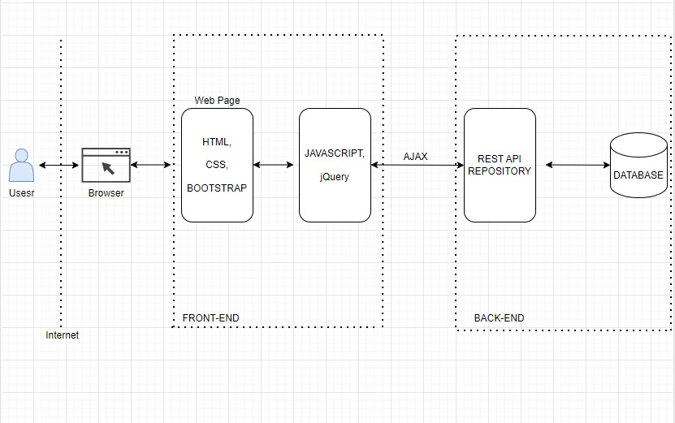
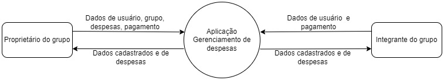

# Front-end Web
<!-- [Inclua uma breve descrição do projeto e seus objetivos.]

O projeto visa simplificar e facilitar a divisão de despesas entre amigos, colegas de quarto, familiares e grupos em geral. Os usuários podem rastrear facilmente quem pagou determinada despesa e quem deve a quem, eliminando a necessidade de realizar cálculos complexos.  

A aplicação permite que os usuários criem grupos para compartilhar despesas, como viagens, refeições, aluguel e outras despesas compartilhadas. Além disso,o cálculo é feito automaticamente quanto cada pessoa deve, com base nas despesas registradas e quantidade de pessoas integrantes no grupo.  

Diante disso, a aplicação possui os seguintes objetivos:   

**Cadastro de despesas:**  
Permitir que os usuários criem novas despesas, especificando detalhes como o valor, a descrição e a data da despesa.
Associar cada despesa a um grupo específico para facilitar a divisão entre os membros. 
**Divisão de despesas:**  
Calcular automaticamente a divisão das despesas entre os membros do grupo.
Permitir que os usuários visualizem quanto cada membro deve pagar ou receber em relação a uma despesa específica. 
**Controle de despesas pagas:**  
Registrar quando um usuário paga uma despesa.
Atualizar automaticamente o saldo de cada usuário no grupo com base nas despesas pagas e na divisão das despesas. 
**Gerenciamento de usuários e grupos:**  
Permitir a criação e a gestão de grupos de usuários.
Facilitar a adição e a remoção de membros de um grupo pelo proprietário. 
**Recursos de autenticação e autorização:**  
Garantir que apenas usuários autorizados possam acessar e manipular dados de despesas e grupos.
Implementar autenticação para proteger as informações sensíveis dos usuários. 
**Notificações e lembretes:**  
Enviar notificações aos usuários sobre novas despesas, alterações na divisão das despesas ou despesas pendentes de pagamento.  -->

**Nome do Projeto**: Gestão de Despesas 
 
**Descrição**: 
Gestão de Despesas é uma aplicação de front-end web projetada para simplificar e facilitar a divisão de despesas entre pessoas e grupos. A plataforma elimina a necessidade de cálculos manuais ao permitir que os usuários rastreiem facilmente quem pagou determinada despesa e quem deve a quem dentro de um grupo. 
 
**Recursos Principais**:
 
 
**Gerenciamento de Grupos**: Os usuários podem criar grupos para compartilhar despesas, como viagens, refeições, aluguel e outras despesas compartilhadas. Cada grupo possui um nome, uma descrição opcional e membros que participam das despesas compartilhadas. 
 
**Registro de Despesas**: Os usuários podem registrar despesas dentro de um grupo, especificando o valor da despesa, o pagador e os participantes que compartilham dessa despesa. Eles também podem adicionar uma descrição para facilitar a identificação da transação. 
 
**Cálculo Automático**: Com base nas despesas registradas, a quantidade de pessoas integrantes no grupo e quem já quitou a dívida, a aplicação realiza automaticamente o cálculo sobre quanto cada pessoa deve ou está devendo. 
 
**Visualização Transparente**: Os usuários têm acesso a uma visualização transparente das despesas do grupo, incluindo quem pagou o quê, quem deve a quem e o saldo atual de cada membro do grupo. Isso permite uma compreensão clara das finanças compartilhadas. 
 
**Histórico de Transações**: Um histórico detalhado de todas as transações realizadas dentro do grupo é mantido, permitindo que os usuários consultem registros passados e acompanhem o histórico de pagamentos. 
 
**Segurança e Privacidade**: A plataforma prioriza a segurança e a privacidade dos dados dos usuários, garantindo que as informações financeiras estejam protegidas e acessíveis apenas para os membros autorizados de cada grupo. 
 
**Objetivo**: 
O objetivo principal do Gestão de Despesas é simplificar e agilizar o processo de divisão de despesas, tornando-o transparente, justo e livre de estresse para todos os envolvidos. Ao automatizar os cálculos e fornecer uma interface intuitiva para rastrear e gerenciar despesas compartilhadas, a aplicação visa promover uma colaboração financeira mais harmoniosa entre amigos, colegas de quarto, familiares e grupos em geral. 
 
## Tecnologias Utilizadas
[Lista das tecnologias principais que serão utilizadas no projeto.]

A API REST de gestão de despesas é desenvolvida na linguagem C# e o framework ASP.NET Core.  

IDE: Visual Studio; Visual Studio Code  
Banco de dados: SQL Server  
Documentação da API: Swagger  
Consumo dos dados da API via AJX  
Desenvolvimento Web: HTML, CSS, JavaScript, Jquery e Bootstrap

## Arquitetura

[Descrição da arquitetura das aplicação web, incluindo os componentes e suas interações.]

A arquitetura Web foi composta da seguinte maneira:  

HTML: Define a estrutura e o conteúdo da página web.  
CSS: Estiliza e define a aparência visual dos elementos HTML.  
JavaScript (incluindo jQuery):  
Manipula elementos HTML para fornecer interatividade e dinamismo à página.  
Responde a eventos do usuário, como cliques em botões e envio de formulários.  
Realiza validações de formulários e outras tarefas de processamento no lado do cliente.  
Bootstrap: Fornece componentes e estilos pré-construídos para criar uma interface de usuário responsiva e visualmente atraente. 
Interação com a API AJAX:  
Realiza solicitações assíncronas para o back-end, obtendo ou enviando dados sem recarregar a página inteira.  
Atualiza dinamicamente o conteúdo da página conforme necessário, oferecendo uma experiência de usuário fluida e responsiva.  

## Modelagem da Aplicação
[Descreva a modelagem da aplicação, incluindo a estrutura de dados, diagramas de classes ou entidades, e outras representações visuais relevantes.]

Entidades: 
1 - Users: Informações cadastrais do usuário. 
2 - Friends: Usuários associados a um grupo de amigos. 
3 - Groups: Registro de dados relacionados ao grupo de despesas.  
4 - Expenses: Registro de despesas e valores associados ao grupo. 
5 - Payments: Registro de pagamentos por integrante do grupo. 

## Projeto da Interface Web
[Descreva o projeto da interface Web da aplicação, incluindo o design visual, layout das páginas, interações do usuário e outros aspectos relevantes.]

### Wireframes
[Inclua os wireframes das páginas principais da interface, mostrando a disposição dos elementos na página.]

### Design Visual
[Descreva o estilo visual da interface, incluindo paleta de cores, tipografia, ícones e outros elementos gráficos.]

### Layout Responsivo
[Discuta como a interface será adaptada para diferentes tamanhos de tela e dispositivos.]

### Interações do Usuário
[Descreva as interações do usuário na interface, como animações, transições entre páginas e outras interações.]

## Fluxo de Dados

[Diagrama ou descrição do fluxo de dados na aplicação.]

O diagrama abaixo ilustra a entrada e saída de dados entre os usuários na aplicação.

 

## Requisitos Funcionais

[Liste os principais requisitos funcionais da aplicação.]

|ID    | Descrição do Requisito  | Prioridade |
|------|-----------------------------------------|----|
|RF-001| Os usuários podem criar grupos para gerenciar despesas. | ALTA |
|RF-002| Deve ser possível adicionar membros aos grupos.  | ALTA |
|RF-003| Os criadores dos grupos têm a capacidade de editar as configurações do grupo. | ALTA |
|RF-004| A aplicação deve garantir que apenas membros autorizados tenham acesso aos grupos de despesas.   | ALTA |
|RF-005| Os próprietários devem ser capazes de registrar despesas, indicando o valor, a descrição e a data. | ALTA |
|RF-006| A aplicação deve calcular automaticamente como dividir as despesas entre os membros do grupo. | ALTA |
|RF-008| Os usuários devem ser capazes de se cadastrar na aplicação. | MÉDIA |

## Requisitos Não Funcionais

[Liste os principais requisitos não funcionais da aplicação, como desempenho, segurança, escalabilidade, etc.]

|ID     | Descrição do Requisito  |Prioridade |
|-------|-------------------------|----|
|RNF-001| A aplicação deverá respeitar às restrições impostas pela LGPD. (SEGURANÇA)| ALTA |
|RNF-002| A aplicação deve garantir a segurança dos dados do usuário. (SEGURANÇA) |  ALTA |

## Considerações de Segurança

[Discuta as considerações de segurança relevantes para a aplicação distribuída, como autenticação, autorização, proteção contra ataques, etc.]

Autenticação e autorização da API através do token JWT.  
Senhas: Armazenamento de senha via banco de dados.

## Implantação

[Instruções para implantar a aplicação distribuída em um ambiente de produção.]

1. Defina os requisitos de hardware e software necessários para implantar a aplicação em um ambiente de produção.
2. Escolha uma plataforma de hospedagem adequada, como um provedor de nuvem ou um servidor dedicado.
3. Configure o ambiente de implantação, incluindo a instalação de dependências e configuração de variáveis de ambiente.
4. Faça o deploy da aplicação no ambiente escolhido, seguindo as instruções específicas da plataforma de hospedagem.
5. Realize testes para garantir que a aplicação esteja funcionando corretamente no ambiente de produção.

## Testes

[Descreva a estratégia de teste, incluindo os tipos de teste a serem realizados (unitários, integração, carga, etc.) e as ferramentas a serem utilizadas.]

1. Crie casos de teste para cobrir todos os requisitos funcionais e não funcionais da aplicação.
2. Implemente testes unitários para testar unidades individuais de código, como funções e classes.
3. Realize testes de integração para verificar a interação correta entre os componentes da aplicação.
4. Execute testes de carga para avaliar o desempenho da aplicação sob carga significativa.
5. Utilize ferramentas de teste adequadas, como frameworks de teste e ferramentas de automação de teste, para agilizar o processo de teste.

# Referências

Inclua todas as referências (livros, artigos, sites, etc) utilizados no desenvolvimento do trabalho.
